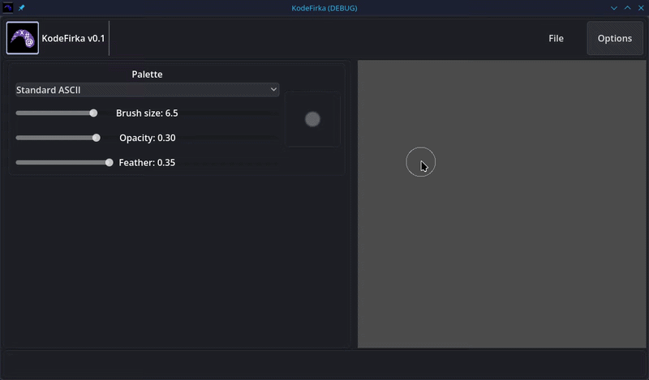

# KodeFirka

A sub-pixel ASCII art editor built with Godot 4.6.2. 

> "This is just a toy I made for myself, don't expect much but I may update it occasionally"

## What is this?

Instead of typical ASCII editors where you place characters one by one, **KodeFirka** lets you paint intensity values into a high-resolution grid (2x3 sub-pixels per character cell). The engine then automatically selects the best matching character in real-time. It's essentially a painting app that natively translates your brush strokes, gradients, and colors into terminal-ready art!

## Features

*(Consider adding a GIF here showing a fast, high-speed drawing process from start to finish)*

### Core Art Engine
- **Sub-Pixel Painting**: Just paint with your brush, the app will automatically detect the best character to pick for that space!
- **Gradient-Aware Translation**: The engine analyzes ink flow to pick characters that match boundaries and corners (e.g., curves and edges).
- **Intensity-Based Shading**: Smooth gradients through multi-level character sets.

### Tools
- **Brush**: Configurable size, opacity, and feathering for soft-edge painting.
- **Eraser**: Subtractive painting to refine your art.
- **Color Tool**: Colorize existing characters without drawing new ones! Supports `Mix`, `Add`, and `Multiply` blend modes.
- **Blur / Softener**: Smooth out harsh edges and intensity gradients locally.
- **Type Tool**: Type characters directly into the canvas for precise text insertion.

*(Consider adding a GIF here showcasing the Color Tool and the Blend Modes in action!)*

### Workflows
- **Palette Picker**: Switch between different character sets (Standard ASCII, Unicode Blocks, etc.) on the fly.
- **Color Spaces**: Lock your project to True Color, 256 Colors, or 16 Colors constraints for authentic terminal aesthetics.
- **Project Backgrounds**: Customizable project background colors, saved per-file.
- **Export Formats**: Export to `.txt` (Plain Text), `.ans` (ANSI Escape Codes), Neofetch templates, and high-resolution `.png` images.

## Getting Started
Download from the releases or:

1. Clone the repo.
2. Open the project in **Godot 4.6+**.
3. Run the project (launches `project_picker.tscn`).
4. Create a **New Project** or select a **Recent File**.
5. Start painting!

## License

This project is licensed under the **Apache License 2.0**. See the [LICENSE](LICENSE) file for details.

---
Have fun artists!